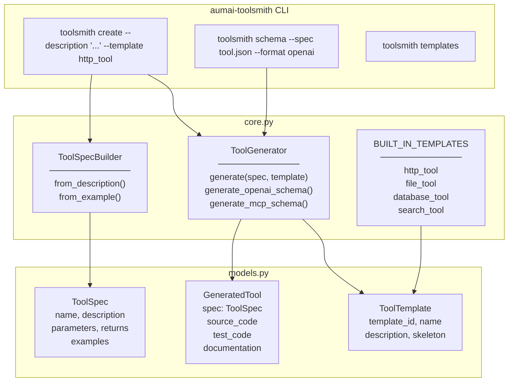

# aumai-toolsmith

**AI-assisted tool creation.** Generate tool definitions from natural language
descriptions, validate schemas, and produce ready-to-use Python source code with
tests and documentation — all from a single description.

Part of the [AumAI](https://github.com/aumai) open-source agentic AI infrastructure suite.

[](https://github.com/aumai/aumai-toolsmith/actions)
[](https://pypi.org/project/aumai-toolsmith/)
[](LICENSE)
[](https://python.org)

---

## What is this?

Writing a tool for an AI agent involves a lot of boilerplate: define the function
signature, write the docstring, generate an OpenAI-compatible JSON schema, write a
pytest stub, and produce Markdown docs. `aumai-toolsmith` automates all of that.

Describe what you want in plain English — "a tool that fetches JSON from a URL given
a URL string" — and ToolSmith produces:

- A structured `ToolSpec` (name, parameters, return type).
- A Python function skeleton with proper type hints and docstring.
- A pytest test stub.
- Markdown documentation.
- An OpenAI function-calling schema.
- A Model Context Protocol (MCP) tool schema.

Think of it as a scaffolding engine for the tool layer of your AI stack.

### Why does this matter?

Every AI agent needs tools — but tool authoring is tedious and error-prone.
Developers forget to mark required parameters, produce schemas that don't match
their function signatures, or write tools that work in isolation but fail when
called by an agent. ToolSmith provides a structured, reproducible path from intent
to implementation:

1. **Describe** — natural language or input/output examples.
2. **Specify** — structured `ToolSpec` with validated parameters and return type.
3. **Generate** — working Python skeleton + tests + docs + schemas in one call.
4. **Integrate** — drop the OpenAI or MCP schema directly into your agent.

---

## Architecture



---

## Features

- **Natural language parsing** — `ToolSpecBuilder.from_description()` extracts a
  snake_case function name from the first verb phrase and infers parameters from
  patterns like "given X", "with X", "for X", "accepts X".
- **Example-driven inference** — `ToolSpecBuilder.from_example()` infers parameter
  names and types from a list of input/output pair dictionaries.
- **Return type heuristics** — description is scanned for keywords (`list`, `bool`,
  `dict`, `json`) to automatically select the appropriate Python return type.
- **Four built-in templates** — `http_tool`, `file_tool`, `database_tool`,
  `search_tool` — each providing a complete, runnable Python skeleton.
- **Code generation** — `ToolGenerator.generate()` produces Python source with
  proper type hints, docstring, Args section, and Returns section.
- **Test scaffolding** — auto-generates a `pytest` test stub with default values
  for each parameter type.
- **Markdown docs** — produces formatted documentation with parameter table,
  return type, and examples section (when examples are provided).
- **OpenAI schema** — `generate_openai_schema()` emits the exact JSON structure
  expected by OpenAI's function-calling API.
- **MCP schema** — `generate_mcp_schema()` emits a Model Context Protocol
  compatible tool definition.
- **Python → JSON Schema type mapping** — `str` → `string`, `int` → `integer`,
  `float` → `number`, `bool` → `boolean`, `list` → `array`, `dict` → `object`.

---

## Quick Start

### Installation

```bash
pip install aumai-toolsmith
```

With YAML support (for `--spec` flag with YAML files):

```bash
pip install "aumai-toolsmith[yaml]"
```

### 1. List available templates

```bash
toolsmith templates
```

```
[http_tool]      HTTP Tool:      Tool that makes HTTP requests.
[file_tool]      File Tool:      Tool that reads or writes files.
[database_tool]  Database Tool:  Tool that queries a database using parameterized SQL.
[search_tool]    Search Tool:    Tool that searches a collection of documents.
```

### 2. Generate a tool from a description

```bash
toolsmith create \
  --description "fetch JSON data from a URL given a url string" \
  --template http_tool \
  --output fetch_data.py
```

```
Generated tool: fetch_json_data_from
--- Source Code ---
import urllib.request
import json as _json
from typing import Any

def fetch_json_data_from(url: str) -> str:
    """fetch JSON data from a URL given a url string"""
    ...
Source saved to fetch_data.py
Tests saved to test_fetch_data.py
```

### 3. Generate a tool without a template

```bash
toolsmith create \
  --description "verify whether a given email address is valid"
```

```
Generated tool: verify_whether_given_email
--- Source Code ---
from __future__ import annotations

def verify_whether_given_email(email: str) -> bool:
    """verify whether a given email address is valid

    Args:
        email: The email input.

    Returns:
        True if successful, False otherwise.
    """
    # TODO: implement tool logic
    raise NotImplementedError
```

### 4. Generate an OpenAI function-calling schema

```bash
toolsmith schema --spec tool.json --format openai
```

```json
{
  "type": "function",
  "function": {
    "name": "search_documents",
    "description": "Search a corpus of documents for a query.",
    "parameters": {
      "type": "object",
      "properties": {
        "query": { "type": "string", "description": "The search query." },
        "limit": { "type": "integer", "description": "Max results to return." }
      },
      "required": ["query", "limit"]
    }
  }
}
```

### 5. Generate an MCP schema

```bash
toolsmith schema --spec tool.json --format mcp
```

---

## CLI Reference

### `toolsmith create`

Generate a Python tool from a natural language description.

```
Usage: toolsmith create [OPTIONS]

Options:
  --description TEXT                Natural language description of the tool.  [required]
  --output PATH                     Output Python file path.
  --template [http_tool|file_tool|database_tool|search_tool]
                                    Built-in template to use.
  --help                            Show this message and exit.
```

When `--output` is provided, two files are written: `<output>.py` and
`test_<output>.py`. Without `--output`, the source code is printed to stdout.

---

### `toolsmith schema`

Read a `ToolSpec` from a JSON or YAML file and emit a function-calling schema.

```
Usage: toolsmith schema [OPTIONS]

Options:
  --spec PATH                      Path to ToolSpec JSON or YAML file.  [required]
  --format [openai|mcp]            Schema format.  [default: openai]
  --help                           Show this message and exit.
```

---

### `toolsmith templates`

List all built-in tool templates with their IDs and descriptions.

```
Usage: toolsmith templates [OPTIONS]

Options:
  --help  Show this message and exit.
```

---

## Python API Examples

### From description to generated tool

```python
from aumai_toolsmith.core import ToolGenerator, ToolSpecBuilder

builder = ToolSpecBuilder()
generator = ToolGenerator()

spec = builder.from_description(
    "search a list of documents for a query string and return matching items"
)
print(spec.name)         # "search_list_documents_query"
print(spec.parameters)   # [{"name": "query", "type": "str", ...}, ...]

tool = generator.generate(spec)
print(tool.source_code)  # Python function with type hints + docstring
print(tool.test_code)    # pytest test stub
print(tool.documentation)  # Markdown docs
```

### Using a built-in template

```python
from aumai_toolsmith.core import BUILT_IN_TEMPLATES, ToolGenerator, ToolSpecBuilder

builder = ToolSpecBuilder()
generator = ToolGenerator()

spec = builder.from_description(
    "fetch JSON from a URL given a url parameter"
)
template = BUILT_IN_TEMPLATES["http_tool"]
tool = generator.generate(spec, template=template)
print(tool.source_code)
```

### From input/output examples

```python
from aumai_toolsmith.core import ToolGenerator, ToolSpecBuilder

builder = ToolSpecBuilder()
generator = ToolGenerator()

spec = builder.from_example([
    {"input": {"text": "Hello world", "lang": "en"}, "output": "Hola mundo"},
    {"input": {"text": "Good morning", "lang": "es"}, "output": "Buenos días"},
])
print(spec.name)         # "inferred_tool"
print(spec.parameters)   # [{"name": "text", "type": "str"}, {"name": "lang", "type": "str"}]
print(spec.returns)      # {"type": "str", "description": "Result of the tool operation."}

tool = generator.generate(spec)
```

### Generating an OpenAI function-calling schema

```python
from aumai_toolsmith.core import ToolGenerator, ToolSpecBuilder

builder = ToolSpecBuilder()
generator = ToolGenerator()

spec = builder.from_description(
    "query a database given a sql string and return a list of rows"
)
schema = generator.generate_openai_schema(spec)
import json
print(json.dumps(schema, indent=2))
```

### Generating an MCP schema

```python
from aumai_toolsmith.core import ToolGenerator, ToolSpecBuilder
from aumai_toolsmith.models import ToolSpec

spec = ToolSpec(
    name="send_email",
    description="Send an email to a recipient.",
    parameters=[
        {"name": "to", "type": "str", "description": "Recipient email.", "required": True},
        {"name": "subject", "type": "str", "description": "Email subject.", "required": True},
        {"name": "body", "type": "str", "description": "Email body.", "required": True},
    ],
    returns={"type": "bool", "description": "True if sent successfully."},
)

generator = ToolGenerator()
mcp_schema = generator.generate_mcp_schema(spec)
import json
print(json.dumps(mcp_schema, indent=2))
```

---

## ToolSpec File Format

A `ToolSpec` JSON or YAML file for use with `toolsmith schema`:

```json
{
  "name": "search_documents",
  "description": "Search a corpus of documents for a query.",
  "parameters": [
    {
      "name": "query",
      "type": "str",
      "description": "The search query string.",
      "required": true
    },
    {
      "name": "limit",
      "type": "int",
      "description": "Maximum number of results to return.",
      "required": true
    }
  ],
  "returns": {
    "type": "list",
    "description": "List of matching documents."
  },
  "examples": [
    {
      "input": {"query": "machine learning", "limit": 5},
      "output": ["doc1.txt", "doc2.txt"]
    }
  ]
}
```

---

## Built-in Templates

| Template ID | Description | Key skeleton feature |
|---|---|---|
| `http_tool` | Makes HTTP requests using `urllib.request` | `urlopen` with User-Agent header |
| `file_tool` | Reads or writes files using `pathlib.Path` | `path.read_text()` |
| `database_tool` | Queries SQLite with parameterized SQL | `sqlite3.connect()` + parameterized `execute()` |
| `search_tool` | Filters a corpus list by query substring | List comprehension with `.lower()` comparison |

Templates use `{placeholders}` in their skeleton strings. `ToolGenerator._generate_source()`
fills in `{name}`, `{params}`, `{return_type}`, and `{description}`. Other placeholders
(e.g. `{url_param}`) remain as-is for the developer to fill in.

---

## How It Works

### Name extraction

`ToolSpecBuilder._extract_name(description)` takes the first five meaningful words
(excluding stop words like `a`, `the`, `for`, `to`, `and`) and joins them with
underscores, truncated to 50 characters.

### Parameter extraction

`_extract_parameters(description)` scans the description for patterns:

- `given X`, `with X`, `for X`, `accepts X`, `takes X`
- `X parameter`
- `input X`

Each unique match becomes a parameter with type `str` and `required: True`.
If no parameters are detected, a default `query: str` parameter is added.

### Return type heuristics

`_extract_returns(description)` checks for keywords:

| Keyword pattern | Inferred return type |
|---|---|
| `list`, `array`, `multiple` | `list` |
| `dict`, `object`, `json` | `dict` |
| `bool`, `whether`, `check`, `verify` | `bool` |
| (default) | `str` |

### Schema generation

Both `generate_openai_schema()` and `generate_mcp_schema()` map Python type names
to JSON Schema types: `str` → `string`, `int` → `integer`, `float` → `number`,
`bool` → `boolean`, `list` → `array`, `dict` → `object`. Unknown types default
to `string`.

---

## Integration with Other AumAI Projects

| Project | How it connects |
|---|---|
| **aumai-skillforge** | Use ToolSmith to generate skill implementations, then register them in SkillForge. |
| **aumai-nanoagent** | Generate edge-optimized tools sized to a device's memory budget. |
| **aumai-specs** | `ToolSpec` parameter/return conventions align with aumai-specs JSON Schema standards. |
| **aumai-registry** | Publish `GeneratedTool` artifacts to a tool registry for team sharing. |

---

## Contributing

```bash
git clone https://github.com/aumai/aumai-toolsmith
cd aumai-toolsmith
pip install -e ".[dev]"
make test
make lint
```

All pull requests must pass `ruff`, `mypy --strict`, and the full `pytest` suite.
Conventional commits are required: `feat:`, `fix:`, `refactor:`, `docs:`, `test:`, `chore:`.

---

## License

Apache License 2.0. See [LICENSE](LICENSE) for details.

```
Copyright 2024 AumAI Contributors

Licensed under the Apache License, Version 2.0 (the "License");
you may not use this file except in compliance with the License.
You may obtain a copy of the License at

    http://www.apache.org/licenses/LICENSE-2.0
```

---

## Part of AumAI

This project is part of [AumAI](https://github.com/aumai) — open-source infrastructure
for the agentic AI era.
